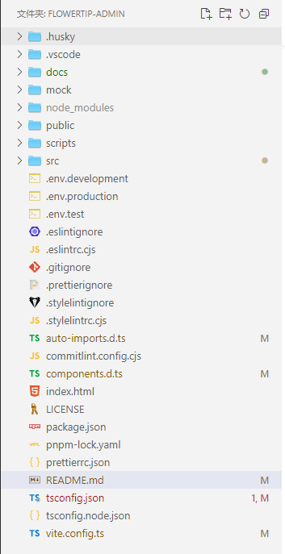

# FlowerTip-Admin

> 一个基于 Vue3 + TypeScript + Element Plus + Axios + Vue Router@4 + Pina + Vite 开发的企业级后台管理系统

## 项目预览

- 在线地址：https://flowertip.cn/admin/#/login
- 默认填充的有超级管理员的账号密码，直接登录
- 可以自行添加测试账号，分配权限

## 新增功能

- 新增 AI 功能


## 项目模块

1. 驾驶舱

2. 表格组件

   - 高级表格
   - 表格筛选

3. 上传组件

   - 头像上传
   - 图片上传
   - 文件上传

4. 表单组件

   - 基础表单
   - 分步表单

5. 图表组件

   - 饼图图表
   - 柱状图表
   - 折线图表
   - 地图图表
   - 混合图表
   - 多折线图表
   - 多柱状图表

6. 常用功能

   - 时间操作
   - 防抖节流
   - 文档预览
   - 水印功能
   - 日历待办
   - 二维码功能
   - 漫游式导航
   - 富文本编辑器
   - 多级菜单
     - 菜单 1
     - 菜单 2
     - 菜单 3
       - 菜单 3-1
       - 菜单 3-2
   - 错误页面
     - 403 页面
     - 404 页面
     - 500 页面

7. 知识库

8. 开源项目

9. 系统管理
   - 权限管理
     - 菜单管理
     - 角色管理
     - 用户管理
   - 组织架构
     - 部门管理
     - 岗位管理

## 安装启动

这里推荐的是 `pnpm` 来管理和安装我们的包，Node 环境建议 18 及以上

```bash

1. cd FlowerTip-Admin # 切换到项目目录

2. pnpm install | pnpm i # 安装项目依赖

3. pnpm run dev | pnpm dev # 启动项目

4. pnpm run build | pnpm build # 打包项目进行部署

```

## 目录结构



- docs 目录存放项目文档
- public 目录存放静态资源
- src 目录存放项目源代码
  - assets 目录存放静态资源
  - components 目录存放公共组件
  - hooks 目录存放自定义 hooks
  - layout 目录存放页面布局
  - views 目录存放页面
  - router 目录存放路由配置
  - store 目录存放全局状态管理
  - utils 目录存放工具函数
  - App.vue 应用组件
  - main.ts 入口文件
  - index.html 入口页面
  - settings.ts 配置文件
  - README.md 项目说明文件
  - tsconfig.json ts 配置文件
  - vite.config.ts vite 配置文件
  - index.d.ts 全局声明文件
  - package.json 项目配置文件
  - pnpm-lock.yaml pnpm 锁文件
  - .env.development 开发环境配置文件
  - .env.production 生产环境配置文件
  - .env.test 测试环境配置文件
  - .gitignore git 忽略文件
  - .eslintrc.cjs eslint 配置文件
  - .prettierrc.js prettier 配置文件

## 项目静态展示

1. 登录页

   

2. 驾驶舱

   

3. 表格组件-高级表格

   

4. 系统管理-用户管理

   

5. 系统管理-角色管理

   

6. 系统管理-菜单管理

   

7. 主题设置

   

8. AI 助手功能

   

## 支持打赏

如果本项目对您有帮助，愿意支持打赏一下作者，可以捐赠一杯咖啡


